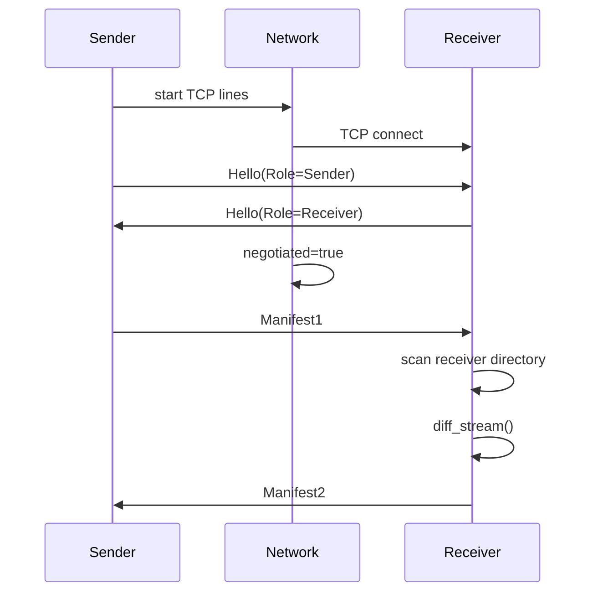
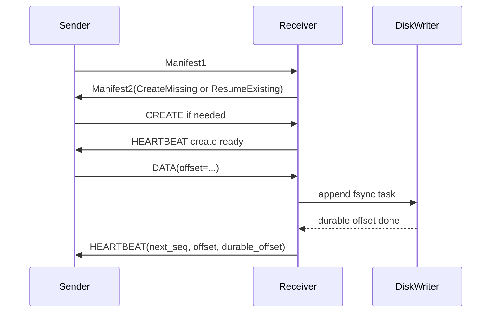
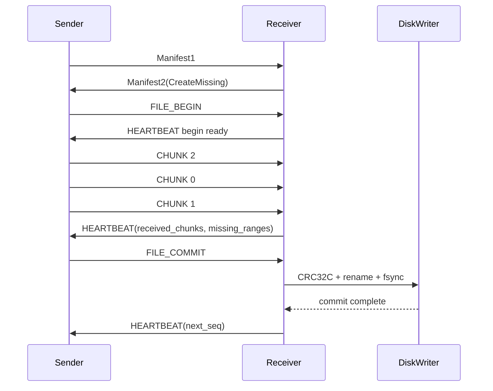

# Yisync 实现细节

本文档讲代码怎么拆、每个模块负责什么、一次同步如何从网络消息走到文件落盘。协议字段的完整定义见 [protocol.md](protocol.md)，构建、运行、配置示例见 [readme.md](readme.md)，未完成事项见 [todo.md](todo.md)。

## 1. 先记住这些规则

当前项目不是完整 rsync，而是一个 append / 新增文件同步原型。核心规则如下：

- A 端叫 `Sender`，负责扫描源目录和发送文件内容。
- B 端叫 `Receiver`，负责扫描目标目录、计算缺什么、写目标目录。
- 启动后不是 B 先报目录，而是 A 先发 `Manifest1`。
- B 收到 `Manifest1` 后扫描自己的目标目录，返回 `Manifest2`。
- A 根据 `Manifest2` 决定跳过、append 续传，或者从头创建。
- Sender 不持久化本地同步进度。
- Receiver 的最终目录是恢复依据。
- `.yisync_tmp` 只服务当前进程内乱序 chunk 接收，不做重启恢复。
- 单个 stream 内只用一个 `seq` 表达严格文件顺序。
- 同一大文件内 chunk 可以乱序接收。
- 小文件和 append 使用 `CREATE + DATA`。
- 大于 64KB 的缺失文件使用 `FILE_BEGIN + CHUNK + FILE_COMMIT`。
- `HEARTBEAT` 是批量 ACK，同时携带窗口、已收 chunk、缺失 chunk hint。
- `NACK` 不直接切 Manifest 恢复，Sender 会先去当前进程发送缓冲区找原包重发。

## 2. 代码分层

`include/` 和 `src/` 使用同一套目录结构：

```text
include/
  core/
  network/
  sender/
  receiver/
  node/

src/
  core/
  network/
  sender/
  receiver/
  node/
  demo/
```

各层职责：

| 层 | 负责什么 | 不负责什么 |
| --- | --- | --- |
| `core/` | wire 消息、frame 编解码、CRC32C、manifest scan/diff、chunk 策略 | TCP、进程入口、具体发送计划 |
| `network/` | event loop、异步 TCP、line connect/accept、Hello 协商、重连、限速、背压、heartbeat 聚合 | 读源文件、写目标文件、业务 diff |
| `sender/` | 源目录 reader、watcher、发送计划、chunk resend、发送缓冲 | TCP socket 细节、Receiver 写盘 |
| `receiver/` | append receiver、chunk receiver、stream map、disk writer、commit poller | 源目录扫描、line 选择 |
| `node/` | 命令行、配置文件、SenderApp、ReceiverApp glue | 协议字段本身 |
| `demo/` | 单进程演示 | 生产路径 |

建议读代码顺序：

1. [include/core/yisync_protocol.hpp](include/core/yisync_protocol.hpp)
2. [include/core/yisync_sync.hpp](include/core/yisync_sync.hpp)
3. [include/network/yisync_network.hpp](include/network/yisync_network.hpp)
4. [include/network/yisync_scheduler.hpp](include/network/yisync_scheduler.hpp)
5. [include/sender/yisync_sender_plan.hpp](include/sender/yisync_sender_plan.hpp)
6. [include/sender/yisync_chunk_resend.hpp](include/sender/yisync_chunk_resend.hpp)
7. [include/sender/yisync_send_buffer.hpp](include/sender/yisync_send_buffer.hpp)
8. [include/receiver/yisync_receiver.hpp](include/receiver/yisync_receiver.hpp)
9. [include/receiver/yisync_receiver_coordinator.hpp](include/receiver/yisync_receiver_coordinator.hpp)
10. [src/sender/yisync_sender_app.cpp](src/sender/yisync_sender_app.cpp)
11. [src/receiver/yisync_receiver_app.cpp](src/receiver/yisync_receiver_app.cpp)

## 3. Core 层

### 协议消息

入口文件：

- [include/core/yisync_protocol.hpp](include/core/yisync_protocol.hpp)
- [src/core/yisync_protocol.cpp](src/core/yisync_protocol.cpp)

这里定义所有上 wire 的消息：

```text
Hello
Manifest1
Manifest2
Create
Data
FileBegin
Chunk
FileCommit
Heartbeat
Nack
```

`Message` 是一个 `std::variant`。网络层只处理 `Message`，不关心具体业务含义。

`encode_frame()` 做两件事：

```text
Message -> body bytes
body bytes + MessageHeader -> TCP frame bytes
```

`decode_frame()` 反过来：

```text
TCP bytes -> MessageHeader + body bytes -> Message
```

当前 decoder 对 trailing bytes 是严格拒绝的，所以协议扩展必须先通过 `Hello` 做 version / capability negotiation。

### Manifest 和 Diff

入口文件：

- [include/core/yisync_sync.hpp](include/core/yisync_sync.hpp)
- [src/core/yisync_sync.cpp](src/core/yisync_sync.cpp)

核心函数：

| 函数 | 作用 |
| --- | --- |
| `scan_manifest_stream()` | 扫描一个目录，生成 `Manifest1Stream` |
| `diff_stream()` | 比较 Sender manifest 和 Receiver manifest，得到本地 `SyncStart` |
| `make_manifest2_stream()` | 把本地 `SyncStart` 转成 wire 上的 `Manifest2Stream` |
| `should_use_chunk_mode()` | 判断文件是否走 chunk，目前阈值是大于 64KB |
| `chunk_count_for_size()` | 计算大文件 chunk 数 |

`StartAction` 是本地状态，不是协议字段。它只存在于 core/sync 和 sender plan 之间：

```text
ResumeExisting  -> Sender 用 DATA 从 start_offset 续传
CreateMissing   -> Sender 从 start_file_id 开始创建
```

wire protocol 里对应的是 `Manifest2Action`。

### 路径安全

Receiver 写文件前必须保证 manifest 里的 `name` 是安全相对路径：

- 不能是空路径。
- 不能是绝对路径。
- 不能包含 `..`。
- 不能逃出 stream root。

软链接同步的是链接本身，`link_target` 是 `readlink()` 的结果，不会跟随软链接目标。

## 4. Network 层

入口文件：

- [include/network/yisync_async.hpp](include/network/yisync_async.hpp)
- [src/network/yisync_async.cpp](src/network/yisync_async.cpp)
- [include/network/yisync_network.hpp](include/network/yisync_network.hpp)
- [src/network/yisync_network.cpp](src/network/yisync_network.cpp)
- [include/network/yisync_scheduler.hpp](include/network/yisync_scheduler.hpp)
- [src/network/yisync_scheduler.cpp](src/network/yisync_scheduler.cpp)

### Event Loop

当前是基于 `poll` 的异步 event loop。它负责：

- socket readable / writable。
- 定时器，例如 tick、heartbeat、commit poll。
- TCP connect。
- TCP listen / accept。
- frame 级读写。

上层不会直接读写 fd，而是注册回调。

### LineEndpoint

`LineEndpoint` 描述一条线路：

```cpp
struct LineEndpoint {
  LineId id;
  Protocol protocol;
  Endpoint endpoint;
  std::string name;
};
```

当前真实实现只有 `Protocol::Tcp`。`Udp / Quic / Areon` 是接口预留，真实 adapter 在 TODO 里。

### SenderNetwork

`SenderNetwork` 是 SenderApp 看到的网络门面。上层主要调用：

```text
send(message, request)
send_control(message, label)
on_message(callback)
on_connected(callback)
on_lost_sends(callback)
on_heartbeat(line_id, heartbeat)
refill_ticks(1)
```

`send()` 发送数据面消息，必须走 scheduler。它会检查：

```text
line connected
line negotiated
line healthy
line not stale
token bucket 有足够 token
in-flight 不超过 recv window
```

`send_control()` 发送控制面消息，例如 `Manifest1`。控制消息进入 network 内部 control queue，由 network 选择健康 line 发送。当前它还不是完整 QoS 队列，后续要和小文件、重传 chunk 合并。

### ReceiverNetwork

`ReceiverNetwork` 是 ReceiverApp 看到的网络门面。上层主要调用：

```text
listen()
send(line_id, message)
queue_heartbeat(line_id, heartbeat)
flush_heartbeats(line_id)
flush_all_heartbeats()
on_message(callback)
```

Receiver 侧 heartbeat 聚合已经放在 network 层。业务层只产出 heartbeat action，network 负责合并和批量 flush。

当前默认逻辑：

```text
每个 stream/line 有一个 pending heartbeat
收到 chunk ack 后累积 received_chunks
达到 heartbeat_ack_batch_size，立即 flush
定时 heartbeat 到期，flush_all_heartbeats
```

### Scheduler

`MultiLineScheduler` 管每条 line 的发送条件：

```text
token bucket
recv_window_bytes
inflight_bytes
pending sends
connected / negotiated / healthy / stale
missed heartbeat ticks
lost sends
```

Sender 每 10ms 调一次：

```text
network_.refill_ticks(1)
```

这会给每条 line 的 token bucket 补 token，并推进 heartbeat timeout。

如果 line 断开或 stale，scheduler 会把该 line 上未确认的 pending sends 转成 `LostSend`，再通过 `SenderNetwork::on_lost_sends()` 回调给 SenderApp。

## 5. Sender 侧

入口文件：

- [include/sender/yisync_source.hpp](include/sender/yisync_source.hpp)
- [src/sender/yisync_source.cpp](src/sender/yisync_source.cpp)
- [include/sender/yisync_sender_plan.hpp](include/sender/yisync_sender_plan.hpp)
- [src/sender/yisync_sender_plan.cpp](src/sender/yisync_sender_plan.cpp)
- [include/sender/yisync_append_state.hpp](include/sender/yisync_append_state.hpp)
- [src/sender/yisync_append_state.cpp](src/sender/yisync_append_state.cpp)
- [include/sender/yisync_chunk_resend.hpp](include/sender/yisync_chunk_resend.hpp)
- [src/sender/yisync_chunk_resend.cpp](src/sender/yisync_chunk_resend.cpp)
- [include/sender/yisync_send_buffer.hpp](include/sender/yisync_send_buffer.hpp)
- [src/sender/yisync_send_buffer.cpp](src/sender/yisync_send_buffer.cpp)
- [src/sender/yisync_sender_app.cpp](src/sender/yisync_sender_app.cpp)

### SourceDirectory

`SourceDirectory` 是真实源目录 reader。

它负责：

- 扫描源目录得到 `Manifest1Stream`。
- 过滤 entry name regex。
- 返回 `SourceFile` 列表。
- 按 `file_id + offset + len` 读取真实文件内容。
- 计算文件 CRC32C。

`SimulatedSourceReader` 是测试和 demo 用的数据源。它和真实 reader 共用 `ISourceReader` 接口，所以 Sender 发送路径不需要区分“真实文件”还是“模拟数据”。

### Watcher

`make_source_watcher()` 创建 watcher：

```text
Linux   -> inotify
macOS   -> FSEvents
fallback -> polling
```

watcher 事件不会直接生成 `CREATE` 或 `DATA`。它只触发：

```text
rescan
重新发送 Manifest1
Receiver 重新生成 Manifest2
Sender 按新的 Manifest2 继续发送
```

这样新增文件、append、事件丢失后的全量 rescan 都走同一条恢复路径。

删除、重命名、原地覆盖不是当前业务语义，watcher 即使观察到这些事件，也不会生成删除或覆盖协议。

### StreamSendState 和 FileSendTask

`StreamSendState` 表示一个 stream 的发送状态：

```text
stream_id
root
entry_name_regex
source_manifest
tasks
current_task
manifest_applied
complete
has_pending_changes
```

`FileSendTask` 表示一个 entry 的发送任务：

```text
stream_id / seq / file_id
kind / name / link_target
source_size / checksum
reader
chunk_mode
append state
chunk_resend
FILE_BEGIN / FILE_COMMIT 状态
```

`AppendSendState` 单独承载 append 续传状态：

```text
是否需要 CREATE
CREATE 是否已发送 / 已确认
DATA 是否已发送
当前 append offset
下一段 DATA offset
当前 DATA 长度
append seq
```

SenderApp 只调用 helper：

```text
start_append_plan()
mark_append_create_sent()
mark_append_data_sent()
mark_append_*_from_heartbeat()
append_lost_matches()
reset_append_inflight()
```

这样 append 的 ack、断线匹配、重传状态更新不会散落在 App 里。

### Sender 启动流程

SenderApp 启动时：

```text
parse options
build_source_streams()
创建 SenderNetwork
注册 on_message / on_connected / on_lost_sends
network.start()
启动 watcher，如果 watch=true
启动 10ms tick
```

`build_source_streams()` 的来源有三种：

1. 没有 `--source-root`，使用模拟数据。
2. 配置了 `high_priority_dirs` / `low_priority_dirs`，每个目录映射成一个 stream。
3. 使用 `--source-root`，如果 root 下有数字目录，则每个数字目录映射成 stream，否则整个 root 是默认 stream。

注意：`high_priority_dirs` 和 `low_priority_dirs` 当前主要是配置分组和 stream 来源。真正的 QoS 权重还没实现，见 [todo.md](todo.md)。

### Manifest1 发送

每条 TCP line 完成 `Hello` 协商后，Sender 会调用：

```text
send_manifest1()
```

`Manifest1` 来自：

```text
manifest1_from_streams(next_manifest_id, streams_)
```

然后进入：

```text
network_.send_control(Message{Manifest1}, label)
```

SenderApp 不再显式指定 line，network 会从可用健康 line 中选择。

### Manifest2 应用

Receiver 回 `Manifest2` 后，Sender 对每个 stream 调用：

```text
apply_manifest2_to_stream(manifest2, stream)
```

返回值有三种结果：

| 结果 | Sender 动作 |
| --- | --- |
| `InSync` | 标记 stream 完成 |
| `ResumeExisting` | 从 `start_offset` 用 `DATA` 续传 |
| `CreateMissing` 且小文件/目录/软链 | 发送 `CREATE`，普通文件继续 `DATA` |
| `CreateMissing` 且大文件 | 发送 `FILE_BEGIN`，进入 chunk 模式 |

### append / 小文件发送

小文件、目录、软链和 append 都在 append 路径里处理。

目录：

```text
CREATE(kind=Directory)
Receiver mkdir
Receiver expected_seq += 1
```

软链接：

```text
CREATE(kind=Symlink, link_target=...)
Receiver symlink
Receiver expected_seq += 1
```

普通小文件：

```text
CREATE(kind=RegularFile, final_size=N)
DATA(offset=0, len<=64KB)
DATA(offset=64KB, len<=64KB)
...
Receiver 写满 final_size
Receiver expected_seq += 1
```

append 续传：

```text
Receiver Manifest2: ResumeExisting(file_id, start_offset)
Sender 不发 CREATE
Sender 从 start_offset 开始发 DATA
```

当前 `DATA` 每段最大等于 `chunk_size`，默认 64KB。即使 append 剩余超过 64KB，也仍然是多段 `DATA`，不会切到 `FILE_BEGIN/CHUNK/FILE_COMMIT`。这个语义在 [todo.md](todo.md) 里保留为待设计项。

### chunk 发送

缺失文件大于 64KB 时进入 chunk 模式：

```text
FILE_BEGIN(seq=N)
CHUNK(seq=N, chunk_index=...)
CHUNK(seq=N, chunk_index=...)
FILE_COMMIT(seq=N)
```

`ChunkResendState` 负责 chunk 级状态：

```text
chunk_count
send order
acked bitmap
sent bitmap
line id
send_tick
attempts
priority bitmap
```

它提供这些动作：

| 函数 | 作用 |
| --- | --- |
| `initialize_chunk_resend_state()` | 初始化发送顺序和 bitmap |
| `next_chunk_to_send()` | 找下一个未发、优先、或 RTO 到期的 chunk |
| `mark_chunk_sent()` | 记录 chunk 发到了哪条 line、当前 tick、attempt |
| `acknowledge_chunk()` | `HEARTBEAT.received_chunks` 到达后确认 chunk |
| `mark_chunk_lost()` | line 断开后把 chunk 标成高优先级 |
| `apply_missing_hints()` | Receiver 告诉缺口后，把对应 chunk 标成高优先级 |

当前默认发送顺序是 tail-first，然后顺序发送剩余 chunk。这个主要是为了测试乱序接收路径，不是协议要求。

### 发送缓冲和重传

`SenderSendBuffer` 保存当前进程内“已发送但未确认”的消息副本。

会进入发送缓冲的消息：

```text
CREATE
DATA
FILE_BEGIN
CHUNK
FILE_COMMIT
```

发送缓冲的释放来源：

```text
HEARTBEAT.next_seq
HEARTBEAT.received_chunks
FILE_BEGIN ready heartbeat
```

收到 `NACK` 时：

```text
SenderSendBuffer 根据 stream/file/seq/offset/chunk_index 找原包
找到 -> 放入 retransmit_queue
找不到 -> 如果 reason 可恢复，重新发送 Manifest1
找不到 -> 如果 reason 不可恢复，最终失败
```

断线时：

```text
network/scheduler 把 line pending sends 转 LostSend
SenderApp 优先从 SenderSendBuffer 找原包重发
找不到时根据类型重置 task 状态或触发 Manifest 恢复
```

RTO 路径：

```text
ACK 样本更新 RtoEstimator
tick 中查 expired_keys
超时消息进入 retransmit_queue
重传次数超过上限 -> Manifest1 恢复
Manifest 恢复次数超过上限 -> final failure
```

## 6. Receiver 侧

入口文件：

- [include/receiver/yisync_receiver.hpp](include/receiver/yisync_receiver.hpp)
- [src/receiver/yisync_receiver.cpp](src/receiver/yisync_receiver.cpp)
- [include/receiver/yisync_receiver_streams.hpp](include/receiver/yisync_receiver_streams.hpp)
- [src/receiver/yisync_receiver_streams.cpp](src/receiver/yisync_receiver_streams.cpp)
- [include/receiver/yisync_receiver_coordinator.hpp](include/receiver/yisync_receiver_coordinator.hpp)
- [src/receiver/yisync_receiver_coordinator.cpp](src/receiver/yisync_receiver_coordinator.cpp)
- [include/receiver/yisync_disk_writer.hpp](include/receiver/yisync_disk_writer.hpp)
- [src/receiver/yisync_disk_writer.cpp](src/receiver/yisync_disk_writer.cpp)
- [include/receiver/yisync_commit_poller.hpp](include/receiver/yisync_commit_poller.hpp)
- [src/receiver/yisync_commit_poller.cpp](src/receiver/yisync_commit_poller.cpp)
- [src/receiver/yisync_receiver_app.cpp](src/receiver/yisync_receiver_app.cpp)

### ReceiverApp

ReceiverApp 是 glue 层。它负责：

- 解析后的 `NodeOptions` 接入。
- 创建 mount root。
- 创建 `ReceiverNetwork`。
- 创建 `ReceiverStreamMap`。
- 创建 `ReceiverCoordinator`。
- 接收 `Manifest1`，生成 `Manifest2`。
- 把 `CREATE/DATA/FILE_BEGIN/CHUNK/FILE_COMMIT` 转给 coordinator。
- 执行 coordinator 返回的 heartbeat / nack / log / poll action。
- 定时 flush heartbeat。
- 定时 poll commit completion。

ReceiverApp 不再直接散落 append/chunk 状态机细节。

### ReceiverStreamMap

`ReceiverStreamMap` 按 stream id 管理接收上下文：

```text
stream_id
root
ReceiverStream append
ChunkedReceiverStream chunk
append durable 状态
chunk commit 状态
```

一个 stream 同时有 append receiver 和 chunk receiver，但同一时刻的业务推进由 `seq` 和 coordinator 保证不会乱序对外可见。

### ReceiverCoordinator

`ReceiverCoordinator` 是 Receiver 侧业务协调层。它接收消息，返回 action batch：

```text
apply_create()
apply_data()
apply_begin()
apply_chunk()
apply_commit()
poll_completions()
```

返回的 action 包含：

```text
heartbeats
nacks
logs
schedule_quiet_stop
schedule_commit_poll
failed
failure message
```

这样 ReceiverApp 只负责执行 action，不直接把错误处理、heartbeat flush、commit poll 和 stream 状态混在一起。

### ReceiverStream

`ReceiverStream` 处理目录、软链接、小文件和 append `DATA`。

`CREATE` 成功后：

```text
Directory -> mkdir -> expected_seq += 1
Symlink   -> symlink -> expected_seq += 1
RegularFile final_size=0 -> create empty file -> expected_seq += 1
RegularFile final_size>0 -> 等 DATA 写满
```

`DATA` 成功后：

```text
校验 seq/file_id/offset/final_size/checksum
append payload
如果写满 final_size，expected_seq 推进
coordinator 可能提交 append fsync task
HEARTBEAT 返回 offset / durable_offset
```

### ChunkedReceiverStream

`ChunkedReceiverStream` 处理大文件：

```text
FILE_BEGIN -> 创建 .yisync_tmp 临时文件和内存 bitmap
CHUNK      -> 校验并按 offset 写临时文件，标记 bitmap
FILE_COMMIT -> 检查所有 chunk 已收到，生成 commit task
```

注意：bitmap 是内存状态，不做持久化。Receiver 创建 chunk stream 时会清理旧 `.yisync_tmp`。

`missing_ranges()` 会根据当前 bitmap 生成缺口范围，用于 `HEARTBEAT.missing_ranges`。Sender 收到后把对应 chunk 标为高优先级重传。

### SpscDiskWriter

`SpscDiskWriter` 是自己实现的 bounded SPSC 队列加后台线程。

它执行会阻塞 event loop 的磁盘任务：

- append 文件 fsync。
- chunk commit 中的整文件 CRC32C。
- rename 临时文件到最终路径。
- fsync 最终文件和父目录。

当前队列容量固定为 128。队列满时还是 fail-fast，后续要接入 scheduler 背压。

### CommitCompletionPoller

chunk commit 在 writer 线程里完成。event loop 不能阻塞等待，所以 `CommitCompletionPoller` 定时检查 completion：

```text
commit task queued
schedule commit poll
writer 完成
poller 发现完成
coordinator 推进 expected_seq
coordinator 产生最终 HEARTBEAT
```

## 7. 端到端流程

### 启动握手



### 小文件或 append



### 大文件 chunk



### NACK 重传

```text
Receiver 拒绝消息并返回 NACK
Sender 根据 NACK 查 SenderSendBuffer
找到原包 -> 进入 retransmit_queue
retransmit_queue 仍经过 network scheduler
发送成功后等待 HEARTBEAT 确认
```

如果发送缓冲找不到，且 reason 可恢复：

```text
Sender 清空当前发送缓冲
重置 stream manifest_applied
重新发送 Manifest1
Receiver 重新扫描目标目录
Receiver 返回新的 Manifest2
Sender 根据最终目录状态续传或重传
```

### TCP line 断开

```text
Async connection close/error
SenderNetwork 标记 line unavailable
Scheduler clear in-flight 并产生 LostSend
SenderApp 收到 LostSend
能在 SenderSendBuffer 找到原包 -> 重发
找不到但可恢复 -> 重新 Manifest1 / Manifest2
SenderLineSet 按 ReconnectPolicy 自动重连
Hello 协商成功后 line 回到 scheduler
```

## 8. 文件系统布局

### 配置目录挂载

Sender 配置：

```ini
[sender]
high_priority_dirs={/private/tmp/yisync_multi_a::.*\.(file|bin)$,/private/tmp/yisync_multi_b::.*\.(keep|dat)$}

[receiver]
mount_dir=/private/tmp/yisync_multi_receiver
```

Receiver 会按 Sender 的源目录绝对路径挂载：

```text
/private/tmp/yisync_multi_receiver/private/tmp/yisync_multi_a/...
/private/tmp/yisync_multi_receiver/private/tmp/yisync_multi_b/...
```

如果源目录不存在，Sender 启动会报错。Receiver 侧目录不存在会自动创建。

### 子目录和空目录

目录作为 `ManifestEntry(kind=Directory)` 进入 manifest。Sender 发送 `CREATE(kind=Directory)`，Receiver 创建目录并推进 `seq`。

这意味着：

```text
source/sub/
source/sub/file.txt
```

会按 manifest 顺序创建：

```text
receiver/.../source/sub/
receiver/.../source/sub/file.txt
```

空目录也会同步。

### 软链接

软链接作为 `ManifestEntry(kind=Symlink)` 进入 manifest。Receiver 创建软链接本身，不读取目标内容。

当前不做软链接 target 变化后的更新策略，因为原地修改/覆盖不是当前场景。

## 9. 持久性和恢复边界

### Sender

Sender 没有本地持久化：

- 不写 checkpoint。
- 不写已发送 chunk bitmap。
- 不写本地 manifest 状态。

Sender 进程重启后，只能重新扫描源目录，再发 `Manifest1`。

### Receiver 最终目录

Receiver 的最终目录是恢复依据：

- 已完成小文件会出现在最终目录。
- 已完成 append 文件的大小和 checksum 会被下次 scan 看到。
- 已完成大文件只有 `FILE_COMMIT` 成功后才 rename 到最终目录。

### `.yisync_tmp`

`.yisync_tmp` 不是恢复依据：

- 存放当前进程内 chunk 临时文件。
- 存放当前进程内乱序 chunk 写入结果。
- Receiver 重启或新建 chunk stream 时会清理旧临时区。
- 未 commit 的大文件不会出现在 `Manifest2` 恢复依据里。

所以大文件如果在 commit 前断到进程重启：

```text
Sender 重新发送 Manifest1
Receiver 扫描最终目录，看不到该大文件
Receiver 返回 Manifest2(CreateMissing)
Sender 从 FILE_BEGIN 重新发送完整大文件
```

## 10. 配置解析

配置解析入口：

- [include/node/yisync_node_common.hpp](include/node/yisync_node_common.hpp)
- [src/node/yisync_node_common.cpp](src/node/yisync_node_common.cpp)

支持：

- `common.link_num`
- `common.Bandwidth_Limit`
- `common.recv_window`
- `common.chunk_size`
- `common.heartbeat_interval_ms`
- `common.heartbeat_ack_batch_size`
- `common.heartbeat_timeout_ticks`
- `common.chunk_retransmit_ticks`
- `common.max_retransmit_retries`
- `common.max_manifest_recovery_attempts`
- `common.max_missing_ranges`
- `common.reconnect_base_delay_ms`
- `common.reconnect_max_delay_ms`
- `common.watch`
- `common.watch_backend`
- `common.watch_interval_ms`
- `common.watch_rescan_debounce_ms`
- `common.compress`
- `common.checksum`
- `sender.high_priority_dirs`
- `sender.low_priority_dirs`
- `receiver.mount_dir`

目录配置格式：

```text
path
path::regex
stream_id:path
stream_id:path::regex
```

多个目录写在 `{}` 中，用逗号分隔。

例子：

```ini
high_priority_dirs={/tmp/a::.*\.(file|bin)$,/tmp/b::.*\.(keep|dat)$}
```

regex 对源目录内的相对路径做 `regex_search`，效果接近 `grep -E`。

配置只在启动时读取。不支持热更新。

## 11. 测试

CTest 入口在 [CMakeLists.txt](CMakeLists.txt)。

运行：

```bash
ctest --test-dir build-cpp20 --output-on-failure
```

C++ 单元测试：

| 文件 | 覆盖点 |
| --- | --- |
| [tests/cpp/protocol_decode_test.cpp](tests/cpp/protocol_decode_test.cpp) | 所有消息 round-trip、Hello negotiation、malformed frame smoke |
| [tests/cpp/network_scheduler_test.cpp](tests/cpp/network_scheduler_test.cpp) | scheduler、line health、lost send、control queue |
| [tests/cpp/chunk_resend_test.cpp](tests/cpp/chunk_resend_test.cpp) | chunk resend、missing hint、lost chunk priority |
| [tests/cpp/receiver_components_test.cpp](tests/cpp/receiver_components_test.cpp) | ReceiverCoordinator、SPSC writer、commit/append 错误 |
| [tests/cpp/fault_client.cpp](tests/cpp/fault_client.cpp) | wire 级坏消息客户端 |

真实 A/B 集成测试：

| scenario | 覆盖点 |
| --- | --- |
| `basic` | 真实目录、小文件、大文件、metrics |
| `reconnect` | 多 line 断线重连、lost send |
| `receiver-restart` | chunk 不持久恢复、`.yisync_tmp` 清理 |
| `entries` | 目录、空目录、软链接 |
| `multistream` | 多源目录、多 stream、regex 过滤 |
| `limit` | 限速和背压路径 |
| `recovery` | 重传失败后重新 Manifest1 / Manifest2 |
| `final-failure` | 恢复次数耗尽后的最终失败 |
| `faults` | `BadChecksum`、`BadCommit`、`SizeConflict` |

## 12. 关键不变量

这些规则如果被破坏，后面的恢复和顺序语义都会出问题：

1. `Manifest1` 只表达 Sender 当前源目录，不表达传输进度。
2. `Manifest2` 只表达 Receiver 根据最终目录算出的起点。
3. Sender 不持久化进度。
4. Receiver 不用 `.yisync_tmp` 做重启恢复。
5. 同一个 stream 内 `seq` 必须严格推进。
6. `CREATE` 语义固定为目标路径必须不存在。
7. `DATA.offset` 必须等于 Receiver 当前文件大小。
8. chunk 可以乱序写 `.tmp`，但 `FILE_COMMIT` 必须等所有 chunk 到齐。
9. `HEARTBEAT.received_chunks` 是当前进程内批量 ACK，不是掉电级持久化证明。
10. `NACK` 先查发送缓冲重发，发送缓冲 miss 后才进入 Manifest 恢复。
11. 所有重发仍必须走 scheduler 的限速和背压。
12. 配置修改必须重启进程才生效。

## 13. 当前边界

已经支持：

- 独立 Sender / Receiver 进程。
- 多 TCP line。
- Hello negotiation。
- Manifest1 / Manifest2。
- 多目录、多 stream。
- regex 过滤。
- 目录、空目录、普通文件、软链接。
- 小文件和 append。
- 大文件 chunk。
- chunk 乱序接收。
- HEARTBEAT 批量 ACK。
- NACK 缓冲重发。
- 动态 RTO。
- Manifest 恢复。
- 后台 disk writer。
- watch 长期运行。

还没做或明确暂不做：

- 完整 QoS 优先级队列。
- UDP / QUIC / AREON adapter。
- LZ4 / Zstd / MD5 实现。
- append 大剩余量切 chunk commit 语义。
- disk writer 队列满后的背压联动。
- 删除、重命名、原地修改、rsync delta。
- 配置热更新。
- chunk 掉电级持久恢复。
