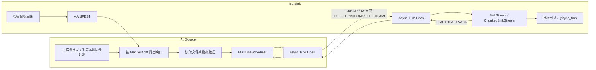
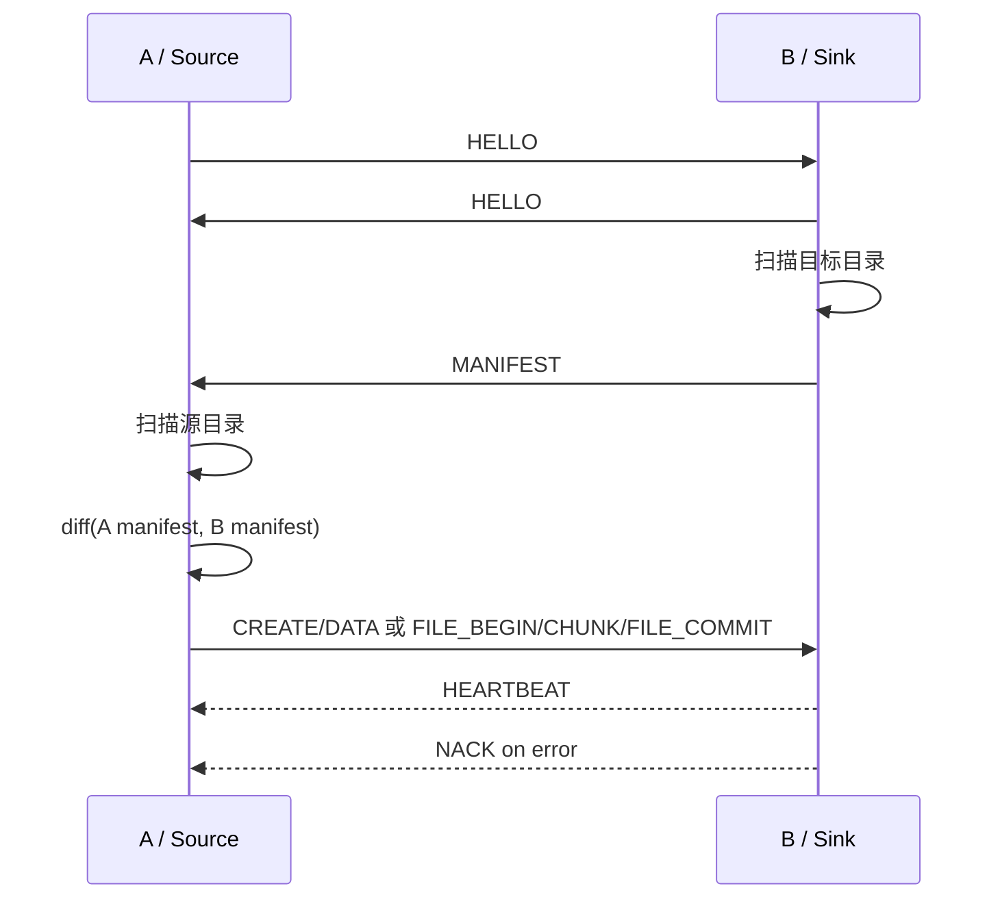
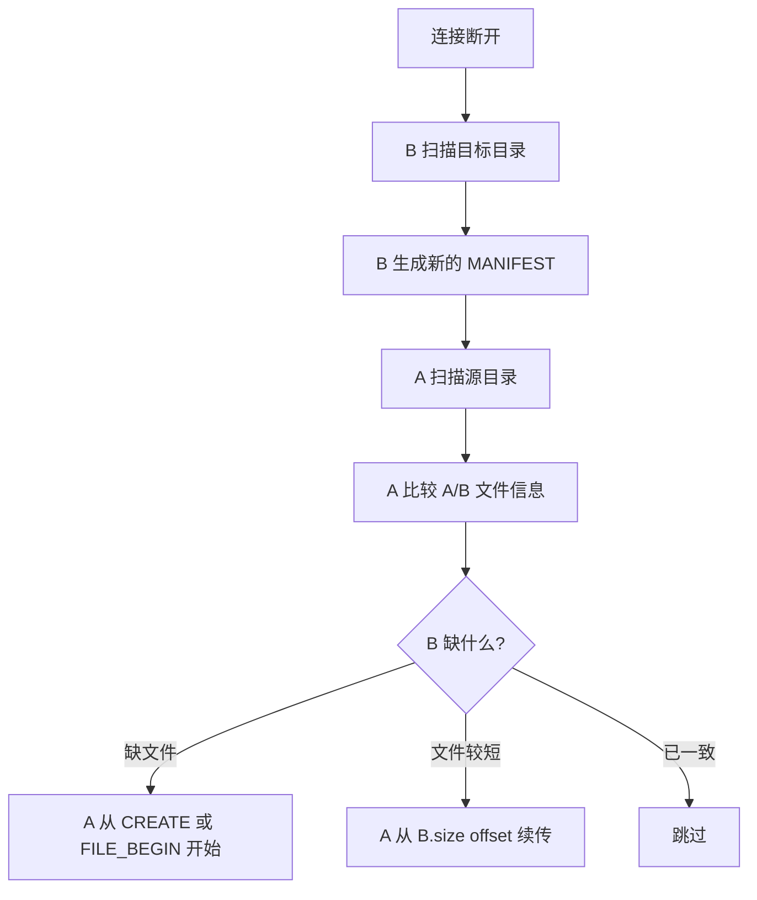
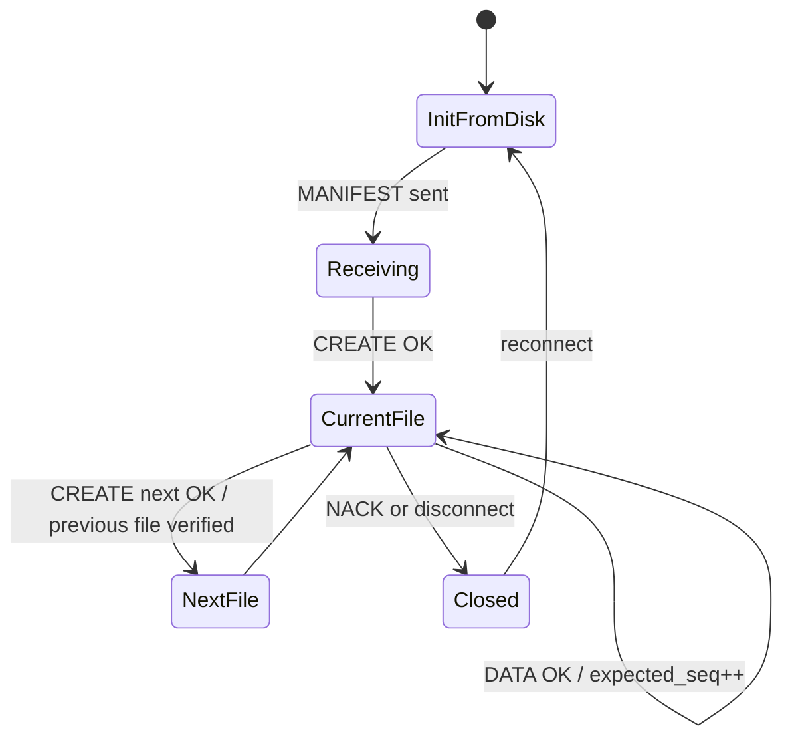
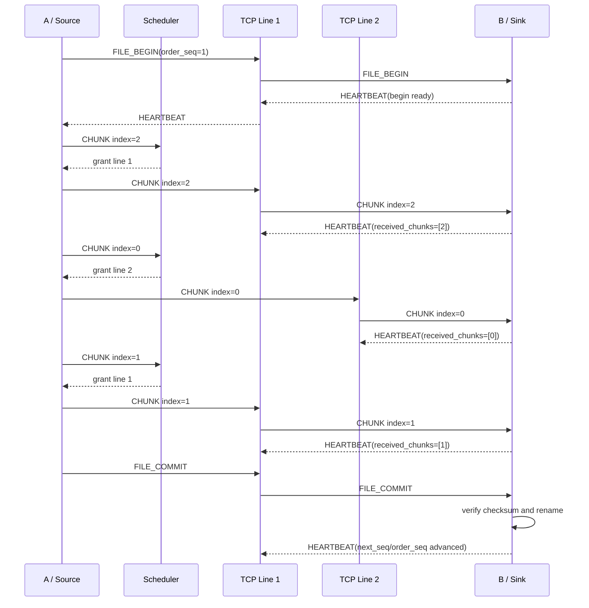
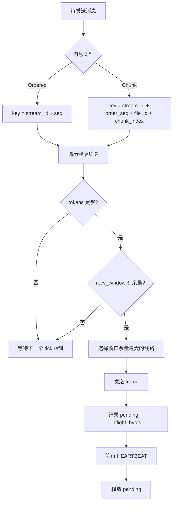

# Yisync 设计与协议说明

本文档是 Yisync 当前阶段的设计总文档，覆盖协议语义、状态机、多线路调度、异步 TCP 原型和当前实现边界。

## 0. 当前结论

重点如下：

- A 端是源端，只负责扫描、比较、读取和发送，不在本地持久化同步进度或数据副本。
- B 端目标目录就是恢复点。断线或进程重启后，B 重新扫描目录生成 `MANIFEST`，A 再 diff 后续传。
- 一个最底层目录对应一个 `stream`。不同 `stream` 可以并行，同一个 `stream` 的文件边界必须严格一致。
- 第一版不使用 `plan_id`，A 端计划只在本地存在，不进入线上协议。
- 成功路径不逐条返回 `ACK`。B 端用 `HEARTBEAT` 汇报进度、窗口和已接收 chunk；失败用 `NACK`。
- 小文件或普通 append 走 `CREATE + DATA`，要求 `seq` 严格递增。
- 文件大小 `> 64KB` 进入 chunk 模式，chunk 大小固定 `64KB`。
- chunk 可以在同一文件内乱序接收，但 `FILE_BEGIN` 和 `FILE_COMMIT` 仍按 `order_seq` 保证文件对外可见顺序。
- 多线路调度器按每条线路的令牌桶、in-flight 字节数和 B 端窗口选择线路。
- 当前 C++20 原型已经有独立 `source` / `sink` 进程，并使用基于 `poll` 的异步 event loop 跑多条 TCP line。

## 1. 目标与边界

### 1.1 目标

Yisync 面向跨机器实时同步，目标是在复杂网络下通过精确流控实现稳定传输，并尽量降低源端到目的端的处理延迟。

核心需求：

- 实时捕获多个源目录的新增和 append 事件。
- 同一个最底层目录内保证因果顺序。
- 支持断线重连和断点续传。
- 优先支持 append-only 增量同步。
- 支持多线路、限速、背压和后续 QoS。
- 后续预留压缩、UDP、QUIC、原地修改等能力。

### 1.2 第一版不做

当前第一版不做：

- 删除和重命名。
- 文件原地修改。
- 复杂 rsync delta 修复。
- A 端本地持久化同步状态。
- 真实目录 watcher。
- 真实源目录文件 reader。
- 配置文件解析。
- UDP / QUIC 真实 transport。
- 压缩实现。

当前代码中的 `yisync_node source` 仍然使用模拟数据源，用于验证独立进程、异步 event loop、多线路 TCP 和 chunk 合并链路。

## 2. 总体架构



组件职责：

| 组件 | 职责 |
| --- | --- |
| `SinkStream` | append-only `CREATE/DATA` 的严格顺序状态机 |
| `ChunkedSinkStream` | 大文件 chunk 模式，支持 chunk 乱序写临时文件，commit 时合并 |
| `MultiLineScheduler` | 每条线路独立限速、背压窗口、in-flight 跟踪 |
| `IFrameTransport` | 阻塞式 frame transport 抽象，已有 memory / TCP |
| `EventLoop` | 基于 `poll` 的非阻塞事件循环 |
| `AsyncFrameConnection` | 异步 TCP frame 拆包、组包、读写队列 |
| `yisync_node` | 独立 A/B 进程 demo |

## 3. 核心概念

### 3.1 角色

```text
A / Source: 源端，负责扫描源目录、读取数据、发送消息。
B / Sink:   目的端，负责上报目录状态、接收消息、写目标目录。
```

### 3.2 Stream

```text
stream = 一个被监听的最底层目录
```

不同 `stream` 可以并行。

同一个 `stream` 内的文件边界必须严格一致：

```text
1.file 完整后，才能对外提交 2.file
2.file 完整后，才能对外提交 3.file
```

### 3.3 File ID

文件名格式：

```text
<file_id>.file
```

例如：

```text
1.file
2.file
3.file
```

同一个 `stream` 内，`file_id` 单调递增。

### 3.4 seq 与 order_seq

append-only 模式使用 `seq`：

```text
CREATE(seq=1)
DATA(seq=2)
DATA(seq=3)
```

B 端只接受：

```text
seq == expected_seq
```

chunk 模式使用 `order_seq` 表达文件级顺序：

```text
FILE_BEGIN(order_seq=1)
CHUNK(order_seq=1, chunk_index=2)
CHUNK(order_seq=1, chunk_index=0)
CHUNK(order_seq=1, chunk_index=1)
FILE_COMMIT(order_seq=1)
```

规则：

- `FILE_BEGIN` 必须先被 B 应用。
- 同一个 `order_seq` 内的 `CHUNK` 可以乱序。
- `FILE_COMMIT` 必须按 `order_seq == expected_order_seq` 提交。
- 提交成功后 `expected_order_seq += 1`。

### 3.5 为什么不要 plan_id

第一版不使用 `plan_id`。

A 端可以生成本地同步计划，但该计划不进入协议。B 端不相信 A 的计划，只相信：

```text
stream_id
seq / order_seq
file_id
offset
chunk_index
本地磁盘状态
CRC32C / MD5 校验
```

这样断线重连更简单：

```text
旧连接废弃
旧 seq 废弃
B 重新 MANIFEST
A 重新 diff
新连接从 seq/order_seq=1 开始
```

## 4. 连接与恢复流程

### 4.1 连接建立



### 4.2 断线重连

断线时：

```text
旧 TCP/QUIC 连接关闭
旧 seq / order_seq 作废
旧 in-flight 消息不重放
```

重连后：



关键点：

- A 不需要保存旧连接的发送计划。
- B 的目标目录状态就是恢复依据。
- 如果 B 已经写入部分数据，A 从 B 上报的 size 或 chunk 状态继续。

当前实现中，append 模式已经支持从 `MANIFEST` 判断 offset 续传；chunk 模式当前原型主要验证乱序 chunk 接收和 commit，尚未实现进程重启后的 chunk bitmap 持久恢复。

## 5. 公共帧格式

所有消息使用统一 frame：

```text
MessageHeader {
  magic:       u32
  version:     u16
  msg_type:    u16
  header_len:  u32
  body_len:    u32
  flags:       u32
}
```

当前建议：

```text
magic = 0x59495359  // "YISY"
version = 1
header_len = 20
```

TCP stream 不保留消息边界，所以 transport 必须根据 `header_len + body_len` 还原完整 frame。

## 6. 消息总览

| 消息 | 方向 | 用途 |
| --- | --- | --- |
| `HELLO` | A <-> B | 能力协商 |
| `MANIFEST` | B -> A | B 上报目标目录状态 |
| `CREATE` | A -> B | 创建新文件，同时作为上一个文件的完成屏障 |
| `DATA` | A -> B | append-only 数据块 |
| `FILE_BEGIN` | A -> B | chunk 模式下建立文件接收上下文 |
| `CHUNK` | A -> B | chunk 模式下的乱序数据块 |
| `FILE_COMMIT` | A -> B | chunk 模式下提交文件 |
| `HEARTBEAT` | B -> A | 进度、持久化 offset、接收窗口、已接收 chunk |
| `NACK` | B -> A | 拒绝消息，A 必须暂停当前 stream |
| `PING` | A <-> B | 预留 |
| `GOAWAY` | A <-> B | 预留 |

## 7. MANIFEST 与 diff

`MANIFEST` 由 B 在连接建立后发送。

```text
MANIFEST {
  manifest_id: u64
  streams: [
    ManifestStream {
      stream_id: u64
      root: string
      entries: [ManifestEntry]
    }
  ]
}

ManifestEntry {
  file_id: u64
  name: string
  size: u64
  checksum: FileChecksum
}
```

diff 规则：

| 情况 | A 端动作 |
| --- | --- |
| B 缺少某个 `file_id` | 从该文件开始创建或 chunk 同步 |
| `B.size < A.size` | 从 `B.size` offset 续传 |
| `B.size == A.size` 且 checksum 一致 | 跳过 |
| `B.size == A.size` 但 checksum 不一致 | 停止并报错 |
| `B.size > A.size` | 停止并报 `SIZE_CONFLICT` |

checksum 用于避免只比较文件大小导致误判。

## 8. append-only 模式

适用场景：

```text
file_size <= 64KB
或当前文件处于普通 append 续传路径
```

### 8.1 CREATE

`CREATE` 创建新文件，并作为上一个文件的完成屏障。

```text
CREATE {
  stream_id: u64
  seq: u64
  file_id: u64
  name: string
  create_mode: MUST_NOT_EXIST | ALLOW_EMPTY_EXISTING
  prev_file_id: u64
  prev_final_size: u64
  prev_checksum: FileChecksum
}
```

B 端校验：

```text
stream_id 正确
seq == expected_seq
file_id == next_create_file_id
prev_file_id 文件存在
prev_file_id size == prev_final_size
prev_checksum 匹配
目标文件不存在，或 create_mode 允许空文件
```

通过后：

```text
expected_seq += 1
current_file_id = file_id
current_offset = 0
next_create_file_id = file_id + 1
```

### 8.2 DATA

```text
DATA {
  stream_id: u64
  seq: u64
  file_id: u64
  offset: u64
  raw_len: u32
  compression: NONE | LZ4 | ZSTD
  checksum_algo: CRC32C | MD5
  checksum: bytes
  payload: bytes
}
```

B 端校验：

```text
stream_id 正确
seq == expected_seq
file_id == current_file_id
offset == 本地文件当前 size
raw_len > 0
payload 解压成功
checksum(raw_data) 匹配
```

通过后：

```text
append raw_data
expected_seq += 1
current_offset = offset + raw_len
```

### 8.3 append 模式状态机



## 9. chunk 模式

适用场景：

```text
file_size > 64KB
chunk_size = 64KB
chunk_count = ceil(file_size / 64KB)
```

注意：等于 `64KB` 不进入 chunk 模式，只有大于 `64KB` 才进入。

### 9.1 消息

```text
FILE_BEGIN {
  stream_id
  order_seq
  file_id
  name
  final_size
  chunk_size
  chunk_count
  file_checksum
  prev_file_id
  prev_final_size
  prev_checksum
}

CHUNK {
  stream_id
  order_seq
  file_id
  chunk_index
  offset
  raw_len
  compression
  checksum_algo
  checksum
  payload
}

FILE_COMMIT {
  stream_id
  order_seq
  file_id
}
```

### 9.2 B 端规则

`FILE_BEGIN`：

```text
order_seq == expected_order_seq
final_size > 64KB
chunk_size == 64KB
chunk_count 正确
前一个文件校验通过
创建 .yisync_tmp 临时文件
初始化 received bitmap
```

`CHUNK`：

```text
order_seq == expected_order_seq
file_id 匹配
chunk_index 在范围内
offset == chunk_index * chunk_size
raw_len 匹配该 chunk 应有长度
CRC32C 匹配
写入临时文件对应 offset
标记 received[chunk_index] = true
```

`FILE_COMMIT`：

```text
order_seq == expected_order_seq
所有 chunk 都已收到
整文件 file_checksum 匹配
rename 临时文件到最终文件
expected_order_seq += 1
```

### 9.3 chunk 模式流程



## 10. HEARTBEAT 与 NACK

### 10.1 HEARTBEAT

B 端不返回逐条 `ACK`。成功路径靠 `HEARTBEAT` 汇报。

```text
HEARTBEAT {
  stream_id: u64
  next_seq: u64
  file_id: u64
  offset: u64
  durable_offset: u64
  recv_window_bytes: u64
  received_chunks: [ReceivedChunk]
}

ReceivedChunk {
  order_seq: u64
  file_id: u64
  chunk_index: u64
}
```

字段含义：

| 字段 | 含义 |
| --- | --- |
| `next_seq` | append-only 模式下 B 下一条期望 seq |
| `file_id` | 当前文件 |
| `offset` | 当前文件已写入 offset |
| `durable_offset` | 当前文件已确认落盘 offset |
| `recv_window_bytes` | B 当前愿意接收的窗口 |
| `received_chunks` | chunk 模式下，本周期已接收并写临时文件的 chunk |

释放 in-flight 的规则：

```text
Ordered 消息:
  CREATE / DATA / FILE_COMMIT
  用 HEARTBEAT.next_seq 释放

Chunk 消息:
  CHUNK
  用 HEARTBEAT.received_chunks 中的 order_seq/file_id/chunk_index 释放
```

### 10.2 NACK

B 拒绝消息时返回 `NACK`。

```text
NACK {
  stream_id: u64
  got_seq: u64
  expected_seq: u64
  file_id: u64
  offset: u64
  expected_file_id: u64
  expected_offset: u64
  reason: NackReason
  detail: string
}
```

A 收到 `NACK` 后必须停止硬推当前 stream。

推荐处理：

```text
暂停 stream
关闭或隔离问题线路
重新获取 MANIFEST
重新 diff
从新的缺口恢复
```

## 11. 多线路调度与背压

每条线路独立维护：

```text
tokens
tokens_per_tick
bucket_capacity
inflight_bytes
recv_window_bytes
healthy
pending sends
```

发送前必须同时满足：

```text
tokens >= message_size
inflight_bytes + message_size <= recv_window_bytes
line healthy
```

发送后：

```text
tokens -= message_size
inflight_bytes += message_size
记录 pending send
```

收到 `HEARTBEAT` 后：

```text
更新 recv_window_bytes
释放已完成 pending send
inflight_bytes -= completed_bytes
```

### 11.1 调度流程图



### 11.2 10ms 平滑限速

例如：

```text
tick = 10ms
tokens_per_tick = 20KB
bucket_capacity = 20KB
```

含义：

```text
每 10ms 每条线路最多发 20KB
上层即使瞬间产生 10MB，也不能一次性倾泻到 socket
```

## 12. 异步 A/B 进程

当前已经有独立进程 demo：

```text
yisync_node sink
yisync_node source
```

### 12.1 sink 进程

职责：

- 按 `--lines` 监听多条 TCP line。
- 每条 line 接收完整 frame。
- 应用 `FILE_BEGIN / CHUNK / FILE_COMMIT`。
- 成功后发送 `HEARTBEAT`。
- 失败后发送 `NACK`。
- commit 成功后目标文件出现在 `--root/<file_id>.file`。

### 12.2 source 进程

职责：

- 连接 sink 的多条 TCP line。
- 发送 `FILE_BEGIN`。
- 等 B 端 heartbeat 表示 begin ready。
- 生成模拟数据并按 `64KB` 切 chunk。
- 通过 `MultiLineScheduler` 将 chunk 分发到不同 line。
- 收到 `received_chunks` 后释放 in-flight。
- 所有 chunk 收齐后发送 `FILE_COMMIT`。

### 12.3 event loop


## 13. 运行方式

编译：

```bash
cmake --build build-cpp20
```

运行单进程综合 demo：

```bash
./build-cpp20/yisync_demo
```

运行独立 A/B 进程：

```bash
./build-cpp20/yisync_node sink \
  --host 127.0.0.1 \
  --base-port 19000 \
  --lines 2 \
  --root /tmp/yisync_sink
```

另一个终端：

```bash
./build-cpp20/yisync_node source \
  --host 127.0.0.1 \
  --base-port 19000 \
  --lines 2 \
  --size 153600
```

预期现象：

```text
source 连接两条 TCP line
source 发送 FILE_BEGIN
source 将多个 CHUNK 分发到不同 line
sink 乱序接收 CHUNK 并写入 .yisync_tmp
source 收到 received_chunks 后释放 in-flight
source 发送 FILE_COMMIT
sink 校验整文件 CRC32C 并 rename 到最终文件
```

## 14. 当前代码地图

| 文件 | 内容 |
| --- | --- |
| `include/yisync_protocol.hpp` | 协议结构、消息类型、状态机接口 |
| `src/yisync_protocol.cpp` | 编解码、manifest diff、append/chunk sink 状态机 |
| `include/yisync_scheduler.hpp` | 令牌桶、多线路 scheduler 接口 |
| `src/yisync_scheduler.cpp` | 限速、背压、in-flight 释放逻辑 |
| `include/yisync_transport.hpp` | 阻塞式 transport 抽象 |
| `src/yisync_transport.cpp` | memory/TCP 阻塞 transport |
| `include/yisync_async.hpp` | event loop 与异步 TCP 接口 |
| `src/yisync_async.cpp` | `poll` event loop、非阻塞 TCP、frame connection |
| `src/main.cpp` | 单进程综合 demo |
| `src/yisync_node.cpp` | 独立 source/sink 进程 demo |

## 15. 后续工作顺序

建议下一步按这个顺序做：

1. 将 `source` 的模拟数据替换成真实文件 reader。
2. 加 source 目录扫描和 manifest diff 到独立进程。
3. 加 sink 启动时主动发送真实 `MANIFEST`。
4. 加 heartbeat 定时批量发送，而不是每个 chunk 立即发。
5. 加 chunk 临时文件 bitmap 的重启恢复。
6. 加配置解析：多目录、多 stream、多 line、限速阈值。
7. 加真实 QoS 队列。
8. 再考虑 UDP / QUIC adapter。

