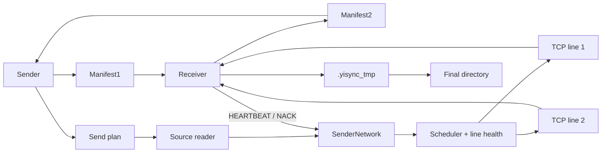

# Yisync

Yisync 是一个 C++20 文件同步原型。当前目标不是做完整 rsync，而是把下面这条核心链路跑清楚：

```text
Sender(A) 扫描源目录
Sender 发送 Manifest1
Receiver(B) 扫描目标目录并计算 Manifest2
Receiver 告诉 Sender 哪些 entry 要传、从哪里续传
Sender 读取真实文件并发送 CREATE/DATA 或 FILE_BEGIN/CHUNK/FILE_COMMIT
Receiver 写入目标目录
```

当前最重要的约束：

- Sender 不做本地持久化同步进度。
- Receiver 的最终目录是恢复依据。
- chunk 临时区 `.yisync_tmp` 不做持久恢复；Receiver 创建 chunk stream 时会清理旧临时区。
- 同一个 stream 内 entry 严格按 `seq` 对外可见。
- 不同 stream 可以并行。
- 当前只支持新增文件、目录、软链接和 append；不支持删除、重命名、原地覆盖、rsync delta。

## 文档分工

- [readme.md](readme.md)：项目入口、构建、运行、配置、测试。
- [protocol.md](protocol.md)：wire 协议、消息字段、状态规则。
- [detail.md](detail.md)：代码结构、模块边界、端到端流程。
- [todo.md](todo.md)：只记录未完成事项。

`crc32c/` 下是第三方 Google CRC32C 库文档，不属于 Yisync 自己的设计文档。

## 当前能力

已经实现：

- 独立 `sender` / `receiver` 进程。
- 基于 `poll` 的异步 TCP event loop。
- 多 TCP line 连接、断线检测、自动重连。
- 每条 line 独立 token bucket 限速、接收窗口背压、in-flight 跟踪、健康状态选择。
- `Hello` version / capability negotiation。
- Sender 启动后先发送 `Manifest1`。
- Receiver 基于 `Manifest1` 和目标目录返回 `Manifest2`。
- Sender 根据 `Manifest2` 生成真实发送计划。
- 真实源目录扫描、真实文件 reader、模拟数据 reader。
- 多文件连续发送。
- 多 stream：配置多个源目录会映射为不同 stream；同 stream 严格顺序，不同 stream 可并行。
- 目录、空目录、普通文件、软链接同步。
- 小文件和 append 使用 `CREATE + DATA`，单条 `DATA` 默认最大 64KB，实际跟随 `chunk_size` 配置。
- 大于 64KB 的缺失文件使用 chunk 模式，默认每 chunk 64KB。
- chunk 可乱序到达，Receiver 写 `.yisync_tmp` 后在 `FILE_COMMIT` 做整文件 CRC32C、rename、fsync。
- Receiver 后台 disk writer 执行 append fsync 和 chunk commit。
- `HEARTBEAT` 作为批量 ACK，同时携带接收窗口、已接收 chunk、缺失 chunk hint、append durable offset。
- Sender 当前进程内保存未确认发送缓冲，`NACK` 先查缓冲重发。
- 断线 lost-send 回调、missing hint、动态 RTO、Manifest 恢复、最终失败上报。
- `config.txt` 配置多 line、多源目录、正则过滤、限速、窗口、重连、chunk size、heartbeat 等参数。
- `watch=true` 长期运行：Linux 使用 `inotify`，macOS 使用 `FSEvents`，不可用时 fallback polling。
- Google CRC32C。
- CTest 自动化测试，覆盖单元测试和真实 A/B 进程集成测试。

未实现或明确不做：

- 删除、重命名、原地修改、rsync delta 当前场景不需要。
- UDP / QUIC / AREON adapter 只有接口预留。
- LZ4 / Zstd / MD5 只有枚举预留。
- 配置热更新不支持，修改配置必须重启。
- chunk 不做掉电级持久恢复。

## 构建

```bash
cmake -S . -B build-cpp20
cmake --build build-cpp20
```

构建产物：

```text
build-cpp20/yisync_demo          单进程综合 demo
build-cpp20/yisync_node          独立 sender / receiver 进程
build-cpp20/yisync_unit_tests    C++ 单元测试
build-cpp20/yisync_fault_client  测试专用坏消息客户端
```

## 测试

```bash
ctest --test-dir build-cpp20 --output-on-failure
```

CTest 当前包含 10 个测试项：

- 协议 round-trip decode。
- malformed frame fuzz smoke test。
- `Hello` negotiation。
- chunk resend / missing hint 状态。
- network scheduler / line health / lost-send。
- ReceiverCoordinator / SPSC disk writer。
- chunk commit 失败、append fsync 失败。
- 真实 A/B 进程同步。
- 断线重连、receiver 重启、目录/软链接、多 stream、限速背压、Manifest 恢复、最终失败。
- fault client wire 级构造 `BadChecksum`、`BadCommit`、`SizeConflict`。

真实 A/B 集成测试需要本机 TCP listen/connect 权限。受限 sandbox 里可能出现 `Operation not permitted`；在允许本机端口的环境中运行即可。

## 快速运行

先启动 Receiver：

```bash
./build-cpp20/yisync_node receiver \
  --host 127.0.0.1 \
  --base-port 19000 \
  --lines 2 \
  --root /tmp/yisync_receiver
```

再启动 Sender，使用模拟数据：

```bash
./build-cpp20/yisync_node sender \
  --host 127.0.0.1 \
  --base-port 19000 \
  --lines 2 \
  --size 153600
```

使用真实源目录：

```bash
mkdir -p /tmp/yisync_source

./build-cpp20/yisync_node sender \
  --host 127.0.0.1 \
  --base-port 19000 \
  --lines 2 \
  --source-root /tmp/yisync_source
```

`/tmp/yisync_source` 中可以放：

- 普通文件
- 子目录
- 空目录
- 软链接

软链接会复制链接本身，不会跟随链接目标。

## 配置文件

也可以用配置文件启动：

```bash
./build-cpp20/yisync_node receiver --config config.txt
./build-cpp20/yisync_node sender --config config.txt
```

配置示例：

```ini
[common]
link_num=2
Bandwidth_Limit={96KB,96KB}
recv_window=192KB
chunk_size=64KB
heartbeat_interval_ms=50
heartbeat_ack_batch_size=20
heartbeat_timeout_ticks=300
chunk_retransmit_ticks=100
max_retransmit_retries=5
max_manifest_recovery_attempts=3
max_missing_ranges=64
reconnect_base_delay_ms=100
reconnect_max_delay_ms=2000
watch=false
watch_backend=auto
watch_interval_ms=500
watch_rescan_debounce_ms=200
compress=none
checksum=crc32c

[sender]
ip=127.0.0.1
port=19000
high_priority_dirs={/private/tmp/yisync_multi_a::.*\.(file|bin)$,/private/tmp/yisync_multi_b::.*\.(keep|dat)$}
low_priority_dirs={/tmp/source_c}

[receiver]
ip=127.0.0.1
port=19000
mount_dir=/tmp/yisync_receiver
```

目录配置规则：

- `high_priority_dirs` 和 `low_priority_dirs` 是 Sender 要同步的源目录列表。
- 多个目录写在同一个 `{}` 里，用逗号分隔。
- 每个目录可以追加 `::regex`。
- regex 对源目录内相对路径做 `regex_search`，接近 `grep -E`。
- 不写 regex 表示同步该目录下所有 entry。
- 目录 entry 会保留，用于创建目标目录结构；普通文件和软链接按 regex 过滤。
- Receiver 只配置 `mount_dir`。
- Receiver 收到 `Manifest1` 后，按 Sender 源目录的绝对路径挂载到 `mount_dir` 下。

例子：

```ini
[sender]
high_priority_dirs={/private/tmp/yisync_multi_a::.*\.(file|bin)$,/private/tmp/yisync_multi_b::.*\.(keep|dat)$}

[receiver]
mount_dir=/private/tmp/yisync_multi_receiver
```

最终写入：

```text
/private/tmp/yisync_multi_receiver/private/tmp/yisync_multi_a/...
/private/tmp/yisync_multi_receiver/private/tmp/yisync_multi_b/...
```

配置只在启动时读取，不支持热更新。

## 多 Stream

配置多个源目录时，每个目录会映射为一个 stream。默认 stream id 是 `9001`。

如果使用 `--source-root`，且根目录下有数字子目录，也会被识别为 stream：

```bash
mkdir -p /tmp/yisync_source/1 /tmp/yisync_source/2

./build-cpp20/yisync_node sender \
  --host 127.0.0.1 \
  --base-port 19000 \
  --lines 2 \
  --source-root /tmp/yisync_source
```

对应关系：

```text
/tmp/yisync_source/1 -> stream 1
/tmp/yisync_source/2 -> stream 2
```

Receiver 目标目录布局：

```text
默认 stream 9001 -> /tmp/yisync_receiver/<相对路径>
其他 stream N   -> /tmp/yisync_receiver/N/<相对路径>
```

## Watch 模式

`watch=true` 时 Sender 和 Receiver 都会长期运行。

Sender watcher 看到新增文件或 append 变长后，不直接生成单条操作，而是：

```text
触发 rescan
重新发送 Manifest1
Receiver 重新计算 Manifest2
Sender 只补新增文件或 append 区间
```

当前 watcher 不生成删除、rename、原地覆盖协议。

## 断线重连测试

可以让 Sender 主动断开一次指定 line：

```bash
./build-cpp20/yisync_node sender \
  --host 127.0.0.1 \
  --base-port 19000 \
  --lines 2 \
  --size 2097152 \
  --drop-line-once 1
```

预期现象：

```text
Sender 连接多条 TCP line
Sender 发送 FILE_BEGIN
Sender 将 CHUNK 分发到不同 line
Receiver 乱序接收 CHUNK 并写入 .yisync_tmp
Receiver 批量 HEARTBEAT 返回 received_chunks / missing_ranges
Sender 释放已确认 in-flight
Sender 发送 FILE_COMMIT
Receiver 后台 writer 校验、rename、fsync
Receiver 在 commit 完成后发送最终 HEARTBEAT
```

## 架构总览



## 代码地图

`src/` 和 `include/` 使用同样的模块分层：

- `core/`：协议、manifest、diff、checksum、chunk 策略。
- `network/`：event loop、异步 TCP、line 状态、重连、调度、限速、背压。
- `sender/`：source reader、watcher、发送计划、chunk resend、发送缓冲、SenderApp。
- `receiver/`：append/chunk receiver、stream map、coordinator、disk writer、commit poller、ReceiverApp。
- `node/`：独立进程入口和公共配置解析。
- `demo/`：单进程 demo。

常用入口：

| 文件 | 说明 |
| --- | --- |
| `include/core/yisync_protocol.hpp` | wire 消息、枚举、frame、CRC32C 接口 |
| `src/core/yisync_protocol.cpp` | 消息编解码、frame 编解码 |
| `include/core/yisync_sync.hpp` | manifest 扫描、diff、chunk 策略接口 |
| `src/core/yisync_sync.cpp` | manifest/diff/checksum/chunk 策略实现 |
| `include/network/yisync_network.hpp` | `SenderNetwork` / `ReceiverNetwork` |
| `src/network/yisync_network.cpp` | TCP line、重连、accept、heartbeat 聚合、line state 日志 |
| `include/network/yisync_scheduler.hpp` | 多线路调度、令牌桶、背压接口 |
| `src/network/yisync_scheduler.cpp` | 限速、选线、in-flight 释放、lost-send |
| `include/sender/yisync_source.hpp` | 源目录 reader 和 watcher 抽象 |
| `src/sender/yisync_source.cpp` | 真实文件 reader、checksum、watcher backend |
| `include/sender/yisync_sender_plan.hpp` | `FileSendTask` / `StreamSendState` / Manifest2 应用 |
| `src/sender/yisync_sender_plan.cpp` | task 构建、payload 读取 |
| `include/sender/yisync_append_state.hpp` | append 续传状态、heartbeat 推进、断线匹配 |
| `src/sender/yisync_append_state.cpp` | append plan 初始化、ack、重传状态更新 |
| `include/sender/yisync_chunk_resend.hpp` | chunk resend / missing hint 状态 |
| `src/sender/yisync_chunk_resend.cpp` | chunk ack、missing hint、lost chunk、重传尝试 |
| `include/sender/yisync_send_buffer.hpp` | 当前进程发送缓存和重传队列 |
| `src/sender/yisync_send_buffer.cpp` | HEARTBEAT 释放缓存、NACK/LostSend 查缓存重传 |
| `src/sender/yisync_sender_app.cpp` | Sender 进程主逻辑 |
| `include/receiver/yisync_receiver.hpp` | append receiver 和 chunk receiver 状态机 |
| `src/receiver/yisync_receiver.cpp` | Receiver 写盘、chunk 乱序接收、commit |
| `include/receiver/yisync_receiver_coordinator.hpp` | Receiver action 协调接口 |
| `src/receiver/yisync_receiver_coordinator.cpp` | CREATE/DATA/FILE_BEGIN/CHUNK/FILE_COMMIT 协调 |
| `include/receiver/yisync_disk_writer.hpp` | bounded SPSC 后台 writer |
| `src/receiver/yisync_disk_writer.cpp` | writer 线程、队列、异常记录 |
| `src/receiver/yisync_receiver_app.cpp` | Receiver 进程 glue |
| `src/node/yisync_node.cpp` | 独立 sender/receiver 进程入口 |
| `src/node/yisync_node_common.cpp` | 参数解析、配置解析、公共工具 |

建议阅读顺序见 [detail.md](detail.md)。
