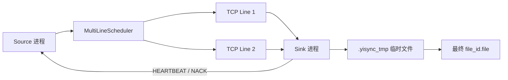
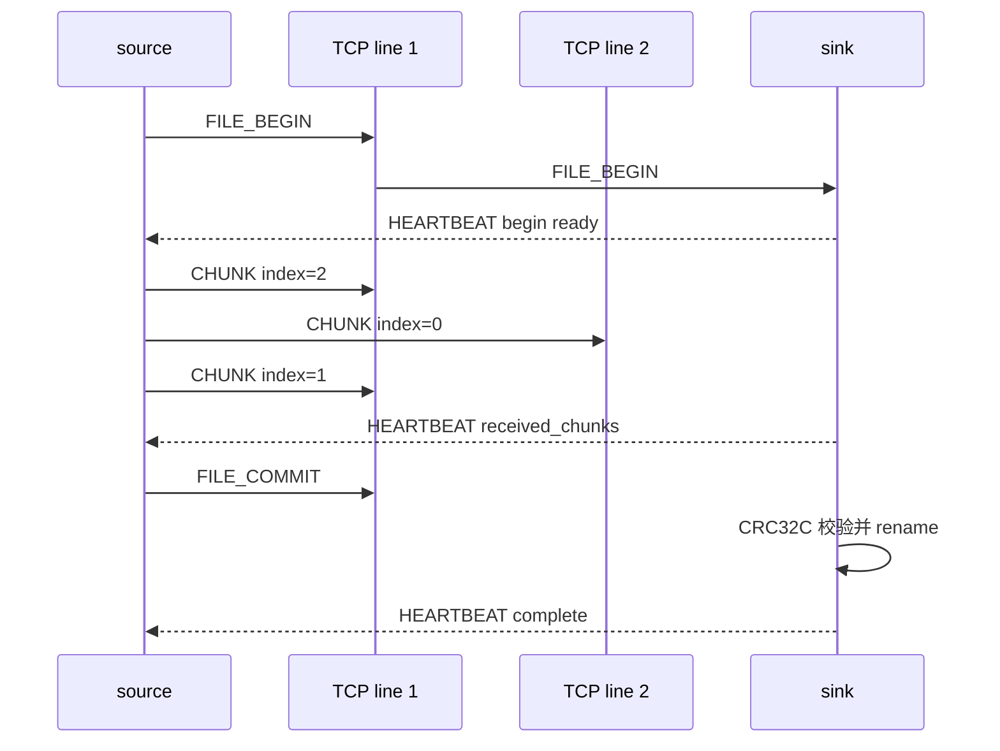

# Yisync

Yisync 是一个面向跨机器实时同步的 C++20 原型。当前目标是先把 append-only、断线恢复、多线路 chunk 分发、精确限速和 B 端顺序合并这些核心链路打通。

详细设计见 [protocol.md](protocol.md)。

## 重点

- A 端不持久化同步数据，断线后依赖 B 端 `MANIFEST` 重新 diff。
- 同一个最底层目录对应一个 `stream`，文件边界严格顺序。
- 小文件走 `CREATE + DATA`。
- 大文件 `> 64KB` 走 `FILE_BEGIN + CHUNK + FILE_COMMIT`，chunk 大小 `64KB`。
- chunk 可以多线路乱序到达，B 端按 `chunk_index` 写临时文件，commit 时校验并 rename。
- 成功路径不用逐条 `ACK`，用 `HEARTBEAT` 汇报进度、窗口和 `received_chunks`。
- 多线路调度使用“背压感知 + 令牌桶”：每条线路独立限速、独立窗口、独立 in-flight。
- 当前已有独立 `source` / `sink` 进程，使用基于 `poll` 的异步 TCP event loop。

## 当前架构



## 构建

```bash
cmake -S . -B build-cpp20
cmake --build build-cpp20
```

## 运行单进程综合 demo

```bash
./build-cpp20/yisync_demo
```

该 demo 覆盖：

- append-only `CREATE/DATA`
- manifest diff
- memory transport
- TCP transport
- 断线重连模拟
- 令牌桶限速和背压
- memory 多线路 chunk
- TCP 多线路 chunk

## 运行独立 A/B 进程

先启动 B 端：

```bash
./build-cpp20/yisync_node sink \
  --host 127.0.0.1 \
  --base-port 19000 \
  --lines 2 \
  --root /tmp/yisync_sink
```

再启动 A 端：

```bash
./build-cpp20/yisync_node source \
  --host 127.0.0.1 \
  --base-port 19000 \
  --lines 2 \
  --size 153600
```

预期流程：



## 代码结构

| 文件 | 说明 |
| --- | --- |
| `include/yisync_protocol.hpp` | 协议消息和状态机接口 |
| `src/yisync_protocol.cpp` | 编解码、manifest diff、append/chunk sink |
| `include/yisync_scheduler.hpp` | 多线路调度与令牌桶接口 |
| `src/yisync_scheduler.cpp` | 限速、背压、in-flight 释放 |
| `include/yisync_transport.hpp` | 阻塞式 transport 抽象 |
| `src/yisync_transport.cpp` | memory/TCP transport |
| `include/yisync_async.hpp` | event loop 与异步 TCP 接口 |
| `src/yisync_async.cpp` | `poll` event loop 和异步 frame connection |
| `src/main.cpp` | 单进程综合 demo |
| `src/yisync_node.cpp` | 独立 source/sink 进程 |

## 尚未实现

- 真实目录 watcher。
- 独立进程中的真实 manifest diff。
- 真实文件 reader。
- chunk bitmap 重启恢复。
- 配置文件解析。
- 压缩。
- UDP / QUIC adapter。
- 文件删除、重命名和原地修改。

