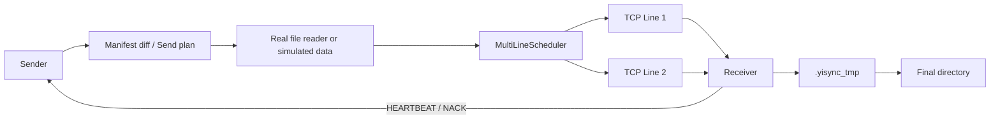

# Yisync

Yisync 是一个 C++20 同步原型。它现在关注的是把核心链路跑通：

- A 端叫 `Sender`，负责扫描源目录、比较差异、读取文件、发送数据。
- B 端叫 `Receiver`，负责上报目录状态、接收数据、写入目标目录。
- Sender 不在本地持久化同步进度。断线或重启后，Receiver 重新发送 `MANIFEST`，Sender 重新 diff 后续传。
- 小文件和 append 走 `CREATE + DATA`。
- 大文件走 `FILE_BEGIN + CHUNK + FILE_COMMIT`，chunk 可以乱序到达，Receiver 最后按顺序 commit。
- 多条 TCP line 可以并行传 chunk，每条 line 有独立限速、背压和健康状态。

这个仓库目前还是原型，不是完整产品。

## 文档入口

- [readme.md](readme.md)：项目入口、构建运行方式、代码地图。
- [protocol.md](protocol.md)：线上协议字段、消息语义、状态规则。
- [detail.md](detail.md)：面向新手的代码细节说明，逐模块讲代码怎么跑。
- [todo.md](todo.md)：后续待办事项和重构清单。

`crc32c/` 下是第三方 Google CRC32C 库文档，不属于 Yisync 自己的设计文档。

## 当前能力

已经跑通的核心能力：

- 独立 `sender` / `receiver` 进程。
- 基于 `poll` 的异步 TCP event loop。
- 多条 TCP line 连接、断线检测、自动重连。
- Receiver 在 TCP line 建立后扫描目标目录并发送真实 `MANIFEST`。
- Sender 支持模拟数据，也支持 `--source-root` 扫描真实源目录。
- Sender 使用 Receiver 的 `MANIFEST` 做 diff，决定哪些文件要传。
- 支持多文件连续发送。
- 支持递归目录树、空目录、普通文件和软链接。
- 支持多 stream：默认 stream 是 `9001`，`--source-root` 下的数字子目录会被当作独立 stream。
- 同一个 stream 内严格按 manifest entry 顺序提交，不同 stream 可并行。
- 小文件和 append 使用 `CREATE + DATA`，单条 `DATA` 最大 `64KB`。
- 大于 `64KB` 的缺失文件使用 chunk 模式，chunk 固定 `64KB`。
- chunk 可以乱序到达，Receiver 写入 `.yisync_tmp` 临时区。
- Receiver 使用 `.meta` checkpoint 记录已持久化 chunk bitmap，进程重启后能恢复未完成 chunk。
- `MANIFEST.incomplete_chunks` 会上报可恢复的 chunk 状态。
- Sender 消费 `MANIFEST.incomplete_chunks`，跳过已 checkpoint 的 chunk，只补缺失 chunk。
- Receiver 使用后台 disk writer 线程执行 checkpoint、append fsync 和 chunk commit。
- `FILE_COMMIT` 的整文件 CRC32C、最终 checkpoint、rename、fsync 已从 event loop 路径移到后台 writer。
- Receiver 批量发送 `HEARTBEAT`，普通数据路径默认每 `50ms` flush。
- `HEARTBEAT` 携带接收窗口、已接收 chunk、缺失 chunk hint、append durable offset。
- Scheduler 支持每条 line 的令牌桶限速、接收窗口背压、in-flight 跟踪和健康状态选择。
- 当前实际校验使用 Google CRC32C。

更多实现细节见 [detail.md](detail.md)。

## 当前边界

还没有做成产品的部分：

- 没有配置文件解析。
- 没有长期运行的真实 watcher。
- Linux `inotify` 和 macOS `FSEvents` 还没有接入，当前只有 polling fallback 接口。
- `--source-root` 当前是启动时一次性扫描和发送，不是持续监听。
- UDP / QUIC adapter 还没有实现。
- LZ4 / Zstd 压缩枚举已预留，但没有实现。
- MD5 枚举已预留，但当前没有实现。
- 删除、重命名、原地修改、rsync delta 还没有实现。
- 协议还没有做 bit packing 和正式兼容策略。

完整待办见 [todo.md](todo.md)。

## 构建

```bash
cmake -S . -B build-cpp20
cmake --build build-cpp20
```

## 运行单进程 demo

```bash
./build-cpp20/yisync_demo
```

这个 demo 会覆盖：

- append `CREATE/DATA`
- manifest diff
- memory transport
- TCP transport
- 断线重连模拟
- 令牌桶限速和背压
- memory 多线路 chunk
- TCP 多线路 chunk
- receiver chunk 重启恢复

## 运行独立 A/B 进程

先启动 Receiver：

```bash
./build-cpp20/yisync_node receiver \
  --host 127.0.0.1 \
  --base-port 19000 \
  --lines 2 \
  --root /tmp/yisync_receiver
```

再启动 Sender，使用模拟数据：

```bash
./build-cpp20/yisync_node sender \
  --host 127.0.0.1 \
  --base-port 19000 \
  --lines 2 \
  --size 153600
```

`--lines` 当前至少为 `2`。

## 使用真实源目录

```bash
mkdir -p /tmp/yisync_source

./build-cpp20/yisync_node sender \
  --host 127.0.0.1 \
  --base-port 19000 \
  --lines 2 \
  --source-root /tmp/yisync_source
```

`/tmp/yisync_source` 里可以放：

- 普通文件
- 子目录
- 空目录
- 软链接

软链接会复制链接本身，不会跟随链接目标。

## 多 stream 源目录

如果 `--source-root` 下有数字子目录，每个数字子目录会成为一个 stream：

```bash
mkdir -p /tmp/yisync_source/1 /tmp/yisync_source/2

./build-cpp20/yisync_node sender \
  --host 127.0.0.1 \
  --base-port 19000 \
  --lines 2 \
  --source-root /tmp/yisync_source
```

对应关系：

```text
/tmp/yisync_source/1 -> stream 1
/tmp/yisync_source/2 -> stream 2
```

Receiver 目标目录布局：

```text
默认 stream 9001 -> /tmp/yisync_receiver/<相对路径>
其他 stream N   -> /tmp/yisync_receiver/N/<相对路径>
```

## 测试断线重连

可以让 Sender 主动断开一次指定 line：

```bash
./build-cpp20/yisync_node sender \
  --host 127.0.0.1 \
  --base-port 19000 \
  --lines 2 \
  --size 2097152 \
  --drop-line-once 1
```

预期现象：

```text
Sender 连接多条 TCP line
Sender 发送 FILE_BEGIN
Sender 将 CHUNK 分发到不同 line
Receiver 乱序接收 CHUNK 并写入 .yisync_tmp
Receiver 批量 HEARTBEAT 返回 received_chunks / missing_ranges
Sender 释放已确认 in-flight
Sender 发送 FILE_COMMIT
Receiver 后台 writer 校验、checkpoint、rename、fsync
Receiver 在 commit 完成后发送最终 HEARTBEAT
```

## 架构总览



## 代码地图

| 文件 | 说明 |
| --- | --- |
| `include/yisync_protocol.hpp` | wire 协议消息、枚举、frame、CRC32C 接口 |
| `src/yisync_protocol.cpp` | 消息编解码、frame 编解码 |
| `include/yisync_sync.hpp` | manifest 扫描、diff、chunk 策略接口 |
| `src/yisync_sync.cpp` | manifest/diff/checksum/chunk 策略实现 |
| `include/yisync_source.hpp` | 源目录 reader 和 watcher 抽象 |
| `src/yisync_source.cpp` | 真实文件 reader、流式 checksum、polling watcher fallback |
| `include/yisync_receiver.hpp` | append receiver 和 chunk receiver 状态机接口 |
| `src/yisync_receiver.cpp` | Receiver 写盘、chunk 乱序接收、checkpoint、commit |
| `include/yisync_scheduler.hpp` | 多线路调度、令牌桶、背压接口 |
| `src/yisync_scheduler.cpp` | 限速、选线、in-flight 释放、线路状态 |
| `include/yisync_transport.hpp` | 阻塞式 frame transport 抽象 |
| `src/yisync_transport.cpp` | memory/TCP 阻塞 transport |
| `include/yisync_async.hpp` | event loop 和异步 TCP 接口 |
| `src/yisync_async.cpp` | `poll` event loop、非阻塞 TCP、frame connection |
| `include/yisync_node_common.hpp` | sender/receiver 进程公共配置和工具函数 |
| `src/yisync_node_common.cpp` | 参数解析、chunk/data 构造、line 配置 |
| `src/yisync_sender_app.cpp` | Sender 进程主逻辑 |
| `src/yisync_receiver_app.cpp` | Receiver 进程主逻辑、heartbeat 聚合、disk writer |
| `src/main.cpp` | 单进程综合 demo |
| `src/yisync_node.cpp` | 独立 sender/receiver 进程入口 |

建议新读代码的人先读 [detail.md](detail.md)，再回到这张代码地图定位文件。
